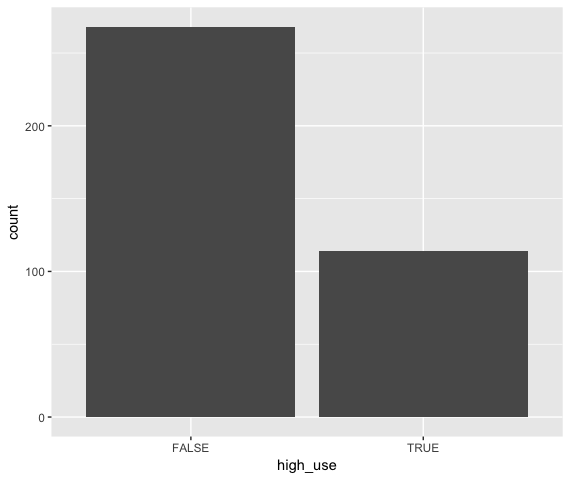
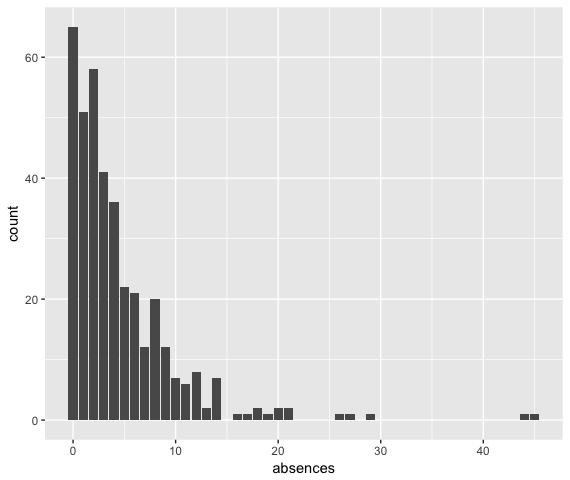
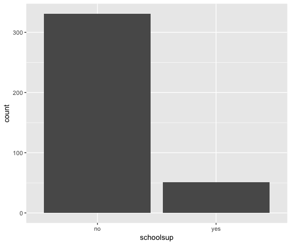
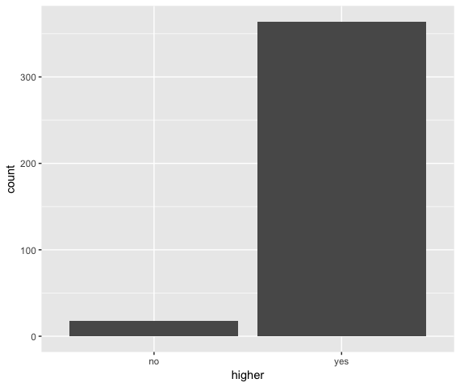
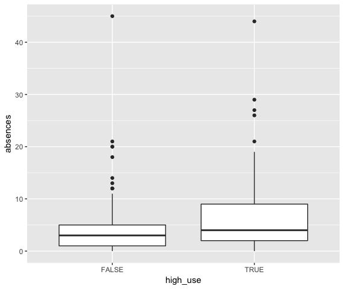
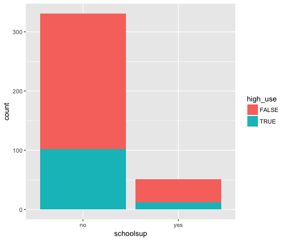
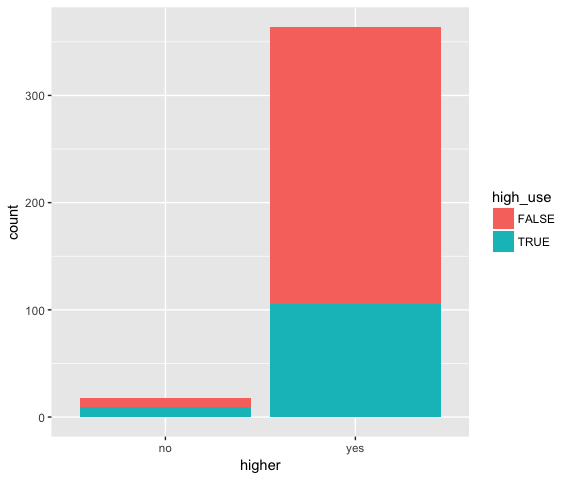
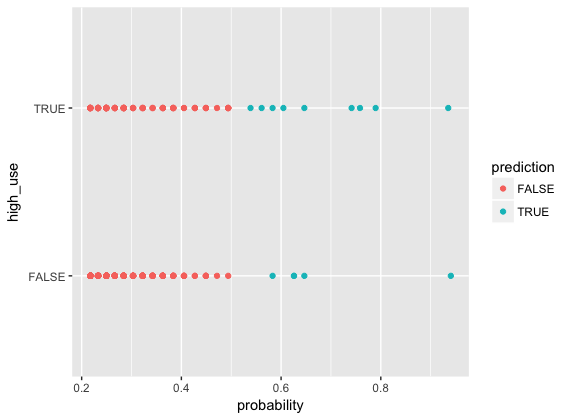

# Exercise 3

#### Part 2

library(dplyr); library(ggplot2); library(GGally)  
install.packages("tidyr")  
library(tidyr)

read data  
read.table("alc.csv", sep = ";", header=TRUE)

print out the names of the variables  
colnames(alc)

The Student Alcohol Consumption Data Sets covers alcohol use within secondary school students. The data set includes socio-economic variables like sex, age, school, family size and parents' cohabitation status, education and job. There are school-related variables such as weekly study time, educational support, etc. and grades (for first and second period and the final grade). There are also free time related variables such as going out with friends, relationships, Internet access, etc. And of course alcohol consumption and health status.

#### Part 3

I chose to study the following variables: number of school absences (absences), extra educational support (schoolsup), wants to take higher education (higher) and high use of alcohol (high_use).

I hypothesize that high alcohol consumption is positively correlated with number of school absences and extra educational support. I hypothesize that those who do not want to take higher education, do not have a greater share of high alcohol use.

#### Part 4

Bar plots  
initialize a plot of alcohol use  
g1 <- ggplot(data = alc, aes(x = high_use))  
define the plot as a bar plot and draw it  
g1 + geom_bar(aes())

g1 <- ggplot(data = alc, aes(x = absences))  
g1 + geom_bar(aes())  

g1 <- ggplot(data = alc, aes(x = schoolsup))  
g1 + geom_bar(aes())  

g1 <- ggplot(data = alc, aes(x = higher))  
g1 + geom_bar(aes())  

  

  

  

Amount of people having more than three absences roughly decreases when amount of absences increase. Only a couple of people have over 25 and over 40 absences. Over half of the students have 4 absences or less. About 50 people of 382 have school support. Most people want to take higher education. Around 50 people do not want to take it. A little more than 100, roughly 120 students, have high alcohol use.

initialize plot  
g1 <- ggplot(alc, aes(x = high_use, y = absences))  
define the plot as boxplot  
g1 + geom_boxplot() + ylab("absences")  

initialize a plot  
g1 <- ggplot(alc, x = schoolsup)  
define the plot as a bar plot and draw it  
g1 + geom_bar(aes(x = schoolsup, fill = high_use))  

g1 <- ggplot(alc, x = higher)  
g1 + geom_bar(aes(x = higher, fill = high_use))  

  

  

  

Those who use a lot of alcohol seem to have more absences from school, about 2-9, when those who do not have high use, have 1-5 absences. Then there are some outliers having more absences that don't fit to the boxplots.  

Those who have school support about 13/50 have high alcohol use, when in those who don't have school support little above 100 have high alcohol use, when over 200 out of about 330 do not have, so the amount of high use seems to be a little bit greater among students who don't have school support.  

In those who want to do higher education, less than half have high alcohol use, when in those who do not want higher education, half have high alcohol use, though amount is relatively small, about ten students.  

I hypothesized that high alcohol consumption is (positively) correlated with number of school absences and extra educational support. And it seemed that those who use more alcohol have also more absences from school. With the school support the relationship was not as expected, students not having extra support having a bit greater amount of high alcohol use. Hypothesis that high use is not correlated with wanting to take higher education proved to be wrong as those who do not want to take higher education had slightly greater share of high alcohol use.

#### Part 5

find the model with glm()  
m <- glm(high_use ~ absences + schoolsup + higher, data = alc, family = "binomial")  

print out a summary of the model  
summary(m)  

print out the coefficients of the model  
coef(m)  

Deviance Residuals:  
Min       1Q   Median       3Q      Max  
-2.6862  -0.8212  -0.7308   1.2255   1.9245  

Coefficients:  
Estimate Std. Error z value Pr(>|z|)  
(Intercept)  -0.47271    0.50483  -0.936 0.349087  
absences      0.09007    0.02325   3.874 0.000107 ***  
schoolsupyes -0.40708    0.36339  -1.120 0.262606  
higheryes    -0.80133    0.50538  -1.586 0.112832  
---  
Signif. codes:  0 ‘***’ 0.001 ‘**’ 0.01 ‘*’ 0.05 ‘.’ 0.1 ‘ ’ 1  

(Dispersion parameter for binomial family taken to be 1)  

Null deviance: 465.68  on 381  degrees of freedom  
Residual deviance: 443.66  on 378  degrees of freedom  
AIC: 451.66  

Number of Fisher Scoring iterations: 4  
(Intercept)     absences schoolsupyes    higheryes  
-0.47270577   0.09006742  -0.40708362  -0.80133283  

It seems that in the logistic regression model only absences were statistically significant, having standard error 0.02325. It seems that absences from school is positively correlated with high alcohol use. The other variables were negative so it seems that school support and higher education would decrease high use of alcohol. Only absences from school are in line with my hypothesis.  

compute odds ratios (OR)  
OR <- coef(m) %>% exp  

compute confidence intervals (CI)  
CI <- confint(m) %>% exp  

print out the odds ratios with their confidence intervals  
cbind(OR, CI)  

OR   2.5 %  97.5 %  
(Intercept)  0.6233134 0.2255444 1.686427  
absences     1.0942481 1.0474022 1.147447  
schoolsupyes 0.6655885 0.3139491 1.319176  
higheryes    0.4487305 0.1651913 1.236214  

The coefficients as odds ratios tell that those who have absences are 1.094 times more likely to have high use than those who do not have absences. Those who have school support, they are 0.655 as likely to have high use. And those who want to have higher education, they are 0.448 as likely to have high use.  

There is probability of 95 % that the value will be on the confidence interval (absence 1.0474022-1.147447, school support 0.3139491-1.319176, higher education 0.1651913-1.236214). Higher education has widest confidence interval and also biggest standard error.  

#### Part 6  

fit the model  
m <- glm(high_use ~ absences, data = alc, family = "binomial")  

predict() the probability of high_use  
probabilities <- predict(m, type = "response")  

add the predicted probabilities to 'alc'  
alc <- mutate(alc, probability = probabilities)  

use the probabilities to make a prediction of high_use  
alc <- mutate(alc, prediction = probability > 0.5)  

tabulate the target variable versus the predictions  
table(high_use = alc$high_use, prediction = alc$prediction)  

prediction  
high_use FALSE TRUE  
  FALSE   263    5  
  TRUE    105    9  
  
initialize a plot of 'high_use' versus 'probability' in 'alc'  
g <- ggplot(alc, aes(x = probability, y = high_use, col = prediction))  

define the geom as points and draw the plot  
g + geom_point()  

  

Absences variable had a statistically significant relation with high use of alcohol so it is used here. Prediction does not capture right amount of high use, not even the magnitude, so the predictive power of the model seems to be not very good. The plot shows insufficiency of the prediction.  

define a loss function  
loss_func <- function(class, prob) {
  n_wrong <- abs(class - prob) > 0.5
  mean(n_wrong)
}  

compute the average number of wrong predictions in the (training) data  
loss_func(class = alc$high_use, prob = alc$probability)  

The share of inaccurately classified individuals (training error) is 0.2879581 that is almost a third of all individuals. It seems to match with the prediction power of earlier predictions. Compared to simple guessing strategy the model gives some information based on tested variables, but as it has so little information it is not so strong.  

#### Part 7  

K-fold cross-validation  
library(boot)  
cv <- cv.glm(data = alc, cost = loss_func, glmfit = m, K = 10)  

average number of wrong predictions in the cross validation  
cv$delta[1]  

With 10-fold cross-validation the model had prediction error (inaccurate classifications) 0.2801047 that is almost a third of all individuals. So my model does not have a better test set performance (smaller prediction error) compared to the model introduced in DataCamp with about 0.26 error. Better model could perhaps be found by testing different explanatory variables and finding other variables that are statistically significant and have together more explanatory power. 

