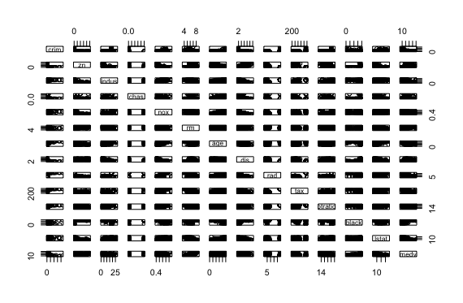
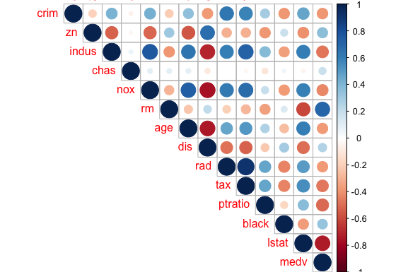
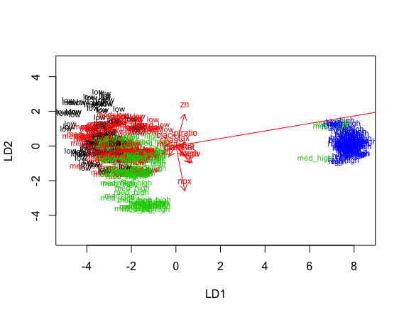
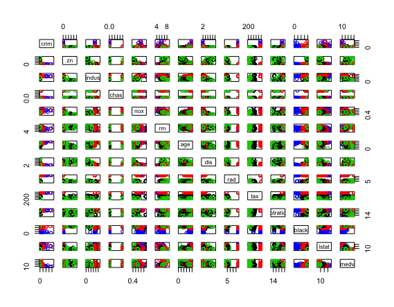
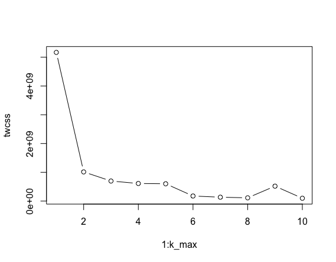
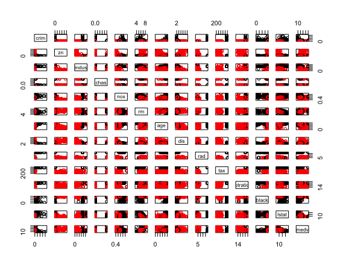
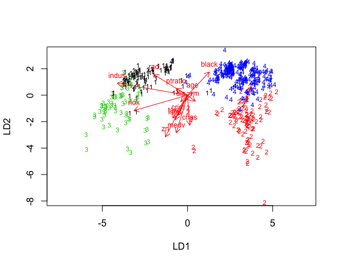

# Exercise 4

#### Part 2

library(MASS)  
data("Boston")

explore the structure and dimensions of the data  
str(Boston)  
dim(Boston)

Housing Values in Suburbs of Boston data set includes 14 variables and 506 observations in the data. The variables include crime rate, different land use variables, environmental variables (river, nitrogen oxides), housing variables (rooms per dwelling, owner-occupied units), accessibility related variables (distances to employment centres, radial highways), property taxation, pupil-teacher ratio, proportion of blacks, lower status of the population and value of owner-occupied homes.

#### Part 3

pairs  
pairs(Boston)

calculate the correlation matrix and round it  
cor_matrix <- cor(Boston) %>% round(2)

print the matrix  
cor_matrix

visualize the matrix  
corrplot(cor_matrix, method="circle", type = "upper")

summaries of the variables  
summary(Boston)

 
  

crim                zn             indus            chas              nox  
Min.   : 0.00632   Min.   :  0.00   Min.   : 0.46   Min.   :0.00000   Min.   :0.3850  
1st Qu.: 0.08204   1st Qu.:  0.00   1st Qu.: 5.19   1st Qu.:0.00000   1st Qu.:0.4490  
Median : 0.25651   Median :  0.00   Median : 9.69   Median :0.00000   Median :0.5380  
Mean   : 3.61352   Mean   : 11.36   Mean   :11.14   Mean   :0.06917   Mean   :0.5547  
3rd Qu.: 3.67708   3rd Qu.: 12.50   3rd Qu.:18.10   3rd Qu.:0.00000   3rd Qu.:0.6240  
Max.   :88.97620   Max.   :100.00   Max.   :27.74   Max.   :1.00000   Max.   :0.8710  
  
rm             age              dis              rad              tax       
 Min.   :3.561   Min.   :  2.90   Min.   : 1.130   Min.   : 1.000   Min.   :187.0  
 1st Qu.:5.886   1st Qu.: 45.02   1st Qu.: 2.100   1st Qu.: 4.000   1st Qu.:279.0  
 Median :6.208   Median : 77.50   Median : 3.207   Median : 5.000   Median :330.0  
 Mean   :6.285   Mean   : 68.57   Mean   : 3.795   Mean   : 9.549   Mean   :408.2  
 3rd Qu.:6.623   3rd Qu.: 94.08   3rd Qu.: 5.188   3rd Qu.:24.000   3rd Qu.:666.0  
 Max.   :8.780   Max.   :100.00   Max.   :12.127   Max.   :24.000   Max.   :711.0  
   
ptratio          black            lstat            medv      
 Min.   :12.60   Min.   :  0.32   Min.   : 1.73   Min.   : 5.00  
 1st Qu.:17.40   1st Qu.:375.38   1st Qu.: 6.95   1st Qu.:17.02  
 Median :19.05   Median :391.44   Median :11.36   Median :21.20  
 Mean   :18.46   Mean   :356.67   Mean   :12.65   Mean   :22.53  
 3rd Qu.:20.20   3rd Qu.:396.23   3rd Qu.:16.95   3rd Qu.:25.00  
 Max.   :22.00   Max.   :396.90   Max.   :37.97   Max.   :50.00  

The distributions of the variables are vary a lot, because the variables are measured differently. In the crime variable most of the values are relatively low the mean being 3,61, but the maximum value being 88,98. The nitrogen oxides concentration variable varies only between 0,39 and 0,87. Then there is also a binary variable of whether there is a river or not.

I find it hard to interpret the pairs plot without colour. I don't know how to add it correctly. 

In the correlation matrix strongest correlation can be found for the darkest blue and red points of which I interpret here those that are around 0,6/-0,6 or greater. It seems that strongest positive (linear) correlation can be found for crime rate (crime), accessibility to radial highways (rad) and property-tax rate (tax); proportion of residential land for big lots (zn) and distances to employment centres (dis); proportion of non-retail business acres (indus) and nitrogen oxide concentration (nox), owner-occupied units built prior to 1940 (age), accessibility to radial highways (rad), property-tax rate (tax) and lower status of the population (lstat); nitrogen oxide concentration (nox) and owner-occupied units built prior to 1940 (age), accessibility to radial highways (rad), property-tax rate (tax), lower status of the population (lstat); number of rooms per dwelling (rm) and value of owner-occupied homes (medv); owner-occupied units built prior to 1940 (age) and lower status of the population (lstat); and accessibility to radial highways (rad) and property-tax rate (tax).

It seems that strongest negative correlation can be found for proportion of residential land for big lots (zn) and owner-occupied units built prior to 1940 (age); proportion of non-retail business acres (indus) and distances to employment centres (dis); nitrogen oxide concentration (nox) and distances to employment centres (dis); number of rooms per dwelling (rm) and lower status of the population (lstat);
owner-occupied units built prior to 1940 (age) and distances to employment centres (dis); and lower status of the population (lstat) and value of owner-occupied homes (medv).

#### Part 4

center and standardize variables  
boston_scaled <- scale(Boston)

summaries of the scaled variables  
summary(boston_scaled)

crim                 zn               indus              chas        
 Min.   :-0.419367   Min.   :-0.48724   Min.   :-1.5563   Min.   :-0.2723  
 1st Qu.:-0.410563   1st Qu.:-0.48724   1st Qu.:-0.8668   1st Qu.:-0.2723  
 Median :-0.390280   Median :-0.48724   Median :-0.2109   Median :-0.2723  
 Mean   : 0.000000   Mean   : 0.00000   Mean   : 0.0000   Mean   : 0.0000  
 3rd Qu.: 0.007389   3rd Qu.: 0.04872   3rd Qu.: 1.0150   3rd Qu.:-0.2723  
 Max.   : 9.924110   Max.   : 3.80047   Max.   : 2.4202   Max.   : 3.6648  
 
nox                rm               age               dis         
 Min.   :-1.4644   Min.   :-3.8764   Min.   :-2.3331   Min.   :-1.2658  
 1st Qu.:-0.9121   1st Qu.:-0.5681   1st Qu.:-0.8366   1st Qu.:-0.8049  
 Median :-0.1441   Median :-0.1084   Median : 0.3171   Median :-0.2790  
 Mean   : 0.0000   Mean   : 0.0000   Mean   : 0.0000   Mean   : 0.0000  
 3rd Qu.: 0.5981   3rd Qu.: 0.4823   3rd Qu.: 0.9059   3rd Qu.: 0.6617  
 Max.   : 2.7296   Max.   : 3.5515   Max.   : 1.1164   Max.   : 3.9566  
 
rad               tax             ptratio            black        
 Min.   :-0.9819   Min.   :-1.3127   Min.   :-2.7047   Min.   :-3.9033  
 1st Qu.:-0.6373   1st Qu.:-0.7668   1st Qu.:-0.4876   1st Qu.: 0.2049  
 Median :-0.5225   Median :-0.4642   Median : 0.2746   Median : 0.3808  
 Mean   : 0.0000   Mean   : 0.0000   Mean   : 0.0000   Mean   : 0.0000  
 3rd Qu.: 1.6596   3rd Qu.: 1.5294   3rd Qu.: 0.8058   3rd Qu.: 0.4332  
 Max.   : 1.6596   Max.   : 1.7964   Max.   : 1.6372   Max.   : 0.4406  
 
lstat              medv        
 Min.   :-1.5296   Min.   :-1.9063  
 1st Qu.:-0.7986   1st Qu.:-0.5989  
 Median :-0.1811   Median :-0.1449  
 Mean   : 0.0000   Mean   : 0.0000  
 3rd Qu.: 0.6024   3rd Qu.: 0.2683  
 Max.   : 3.5453   Max.   : 2.9865 

The variables changed so that they are now in the same scale.

change the object to data frame  
boston_scaled <- as.data.frame(boston_scaled)

save the scaled crim as scaled_crim  
scaled_crim <- boston_scaled$crim

summary of the scaled_crim  
summary(scaled_crim)

Min.    1st Qu.   Median    Mean    3rd Qu.   Max.  
-0.419400 -0.410600 -0.390300  0.000000  0.007389  9.924000 

create a quantile vector of crim and print it  
bins <- quantile(scaled_crim)  
bins

0%          25%          50%          75%         100%  
-0.419366929 -0.410563278 -0.390280295  0.007389247  9.924109610 

create a categorical variable crime  
crime <- cut(scaled_crim, breaks = bins, include.lowest = TRUE, label = c("low", "med_low", "med_high", "high"))

look at the table of the new factor crime  
table(crime)

crime  
low  med_low med_high     high  
127      126      126      127 

remove original crim from the dataset  
boston_scaled <- dplyr::select(boston_scaled, -crim)

add the new categorical value to scaled data  
boston_scaled <- data.frame(boston_scaled, crime)

number of rows in the Boston dataset  
n <- nrow(boston_scaled)

choose randomly 80% of the rows  
ind <- sample(n,  size = n * 0.8)

create train set  
train <- boston_scaled[ind,]

create test set  
test <- boston_scaled[-ind,]

#### Part 5 

linear discriminant analysis  
lda.fit <- lda(crime ~ ., data = train)

print lda.fit  
lda.fit

the function for lda biplot arrows  
lda.arrows <- function(x, myscale = 1, arrow_heads = 0.1, color = "red", tex = 0.75, choices = c(1,2)){
  heads <- coef(x)
  arrows(x0 = 0, y0 = 0, 
         x1 = myscale * heads[,choices[1]], 
         y1 = myscale * heads[,choices[2]], col=color, length = arrow_heads)
  text(myscale * heads[,choices], labels = row.names(heads), 
       cex = tex, col=color, pos=3)
}

target classes as numeric  
classes <- as.numeric(train$crime)

plot the lda results  
plot(lda.fit, dimen = 2, col = classes, pch = classes)  
lda.arrows(lda.fit, myscale = 3)

Call:  
lda(crime ~ ., data = train)

Prior probabilities of groups:  
     low   med_low  med_high      high  
0.2500000 0.2475248 0.2475248 0.2549505 

Group means:  
zn      indus         chas        nox         rm        age        dis  
low      0.8807952 -0.8880336 -0.155385496 -0.8514698  0.4830163 -0.8620946 0.8136424  
med_low -0.1139947 -0.3347319  0.003267949 -0.5668569 -0.1729169 -0.3390155 0.3663578  
med_high -0.3920529 0.1568464 0.278864965  0.4506040  0.1769749  0.4246388 -0.3936970  
high   -0.4872402  1.0149946 -0.042983423  1.0284036 -0.3656833  0.7798295 -0.8418957  
  
rad        tax     ptratio       black       lstat          medv  
low      -0.6839520 -0.7551266 -0.45234209  0.37918726 -0.76166587  0.5829283904  
med_low  -0.5408599 -0.5106125 -0.07599895  0.32689866 -0.12448615 -0.0004138612  
med_high -0.4374978 -0.3536738 -0.43166610  0.07480233 -0.03493364  0.2626037123  
high      1.6596029  1.5294129  0.80577843 -0.83671433  0.82571076 -0.6766366377  

Coefficients of linear discriminants:  
              LD1         LD2         LD3  
zn       0.1311346  0.61498768 -0.97220605  
indus    0.1125667 -0.17975648  0.22316433  
chas    -0.1053063 -0.06552749  0.08807031  
nox      0.1314185 -0.86236376 -1.19853100  
rm      -0.2131915 -0.15725720 -0.27580077  
age      0.2387591 -0.32128671 -0.03685391  
dis     -0.1006093 -0.19573826  0.18502432  
rad      4.0952131  0.88542703 -0.21730691  
tax      0.1204945 -0.02782172  0.55864496  
ptratio  0.1468013  0.07319516 -0.27207659  
black   -0.1454276  0.02649139  0.09732558  
lstat    0.1636894 -0.19847964  0.35691176  
medv     0.2127097 -0.32898904 -0.13336891

Proportion of trace:  
  LD1    LD2    LD3  
0.9649 0.0264 0.0087 

 

#### Part 6

save the correct classes from test data  
correct_classes <- test$crime

remove the crime variable from test data  
test <- dplyr::select(test, -crime)

predict classes with test data  
lda.pred <- predict(lda.fit, newdata = test)

cross tabulate the results  
table(correct = correct_classes, predicted = lda.pred$class)  
  
predicted  
correct    low med_low med_high high  
low       21       5        0    0  
med_low    8      14        4    0  
med_high   1       8       14    3  
high       0       0        1   23

There were 21 values in the low category and the model predicted 9 wrong. There were 14 values in the med low category, but the model predicted 13 wrong. There were 14 values in the med high category, and with the model there were 5 incorrectly categorized values. There were 23 values in the high category and the model predicted 3 wrong. The LDA model did not give very good prediction of the classes when compared to crime categories from the test set.

#### Part 7

reload data  
data("Boston")

center and standardize variables  
boston_scaled <- scale(Boston)

euclidean distance matrix  
dist_eu <- dist(Boston, method = "euclidean")

summary of the distances  
summary(dist_eu)  

Min. 1st Qu.  Median    Mean 3rd Qu.    Max.  
1.119  85.620 170.500 226.300 371.900 626.000 

k-means clustering  
km <-kmeans(dist_eu, centers = 4) 

plot the Boston dataset with clusters  
pairs(Boston, col = km$cluster)

 

deal with randomly assigned cluster centre  
set.seed(123)

determine the max number of clusters  
k_max <- 10 

calculate the total within sum of squares  
twcss <- sapply(1:k_max, function(k){kmeans(dist_eu, k)$tot.withinss})

visualize the results  
plot(1:k_max, twcss, type='b')

  

k-means clustering  
km <-kmeans(dist_eu, centers = 2) 

plot the Boston dataset with clusters  
pairs(Boston, col = km$cluster)

 

Here 2 clusters would seem optimal, because the value of total WCSS changes radically at that point. The clusters do not seem to be very overlapping in the pairs plot so the number of clusters seems to be fairly good.

#### Bonus

reload data  
data("Boston")

center and standardize variables  
boston_scaled <- scale(Boston)

change the object to data frame  
boston_scaled <- as.data.frame(boston_scaled)

first calculate the distances between the observations  
dist_eu <- dist(boston_scaled, method = "euclidean")  

k-means clustering  
km <-kmeans(dist_eu, centers = 4) 

linear discriminant analysis  
lda.fit <- lda(km$cluster ~ ., data = boston_scaled) 

print lda.fit  
lda.fit

Call:  
lda(km$cluster ~ ., data = boston_scaled)

Prior probabilities of groups:  
        1         2         3         4  
0.2272727 0.2114625 0.1304348 0.4308300  

Group means:  
        crim         zn      indus       chas        nox         rm        age  
1  0.2797949 -0.4872402  1.1892663 -0.2723291  0.8998296 -0.2770011  0.7716696  
2 -0.3912182  1.2671159 -0.8754697  0.5739635 -0.7359091  0.9938426 -0.6949417  
3  1.4330759 -0.4872402  1.0689719  0.4435073  1.3439101 -0.7461469  0.8575386  
4 -0.3894453 -0.2173896 -0.5212959 -0.2723291 -0.5203495 -0.1157814 -0.3256000  
  
dis        rad        tax     ptratio       black      lstat        medv  
1 -0.7723199  0.9006160  1.0311612  0.60093343 -0.01717546  0.6116223 -0.54636549  
2  0.7751031 -0.5965444 -0.6369476 -0.96586616  0.34190729 -0.8200275  1.11919598  
3 -0.9620552  1.2941816  1.2970210  0.42015742 -1.65562038  1.1930953 -0.81904111  
4  0.3182404 -0.5741127 -0.6240070  0.02986213  0.34248644 -0.2813666 -0.01314324

Coefficients of linear discriminants:  
                LD1        LD2         LD3  
crim    -0.18113078 -0.5012256 -0.60535205  
zn      -0.43297497 -1.0486194  0.67406151  
indus   -1.37753200  0.3016928  1.07034034  
chas     0.04307937 -0.7598229 -0.22448239  
nox     -1.04674638 -0.3861005 -0.33268952  
rm       0.14912869 -0.1510367  0.67942589  
age      0.09897424  0.0523110  0.26285587  
dis     -0.13139210 -0.1593367 -0.03487882  
rad     -0.65824136  0.5189795  0.48145070  
tax     -0.28903561 -0.5773959  0.10350513  
ptratio -0.22236843  0.1668597 -0.09181715  
black    0.42730704  0.5843973  0.89869354  
lstat   -0.24320629 -0.6197780 -0.01119242  
medv    -0.21961575 -0.9485829 -0.17065360  

Proportion of trace:  
LD1    LD2    LD3  
0.7596 0.1768 0.0636  

the function for lda biplot arrows  
lda.arrows <- function(x, myscale = 1, arrow_heads = 0.1, color = "red", tex = 0.75, choices = c(1,2)){
  heads <- coef(x)
  arrows(x0 = 0, y0 = 0, 
         x1 = myscale * heads[,choices[1]], 
         y1 = myscale * heads[,choices[2]], col=color, length = arrow_heads)
  text(myscale * heads[,choices], labels = row.names(heads), 
       cex = tex, col=color, pos=3)
}

target classes as numeric  
classes <- as.numeric(km$cluster) 

plot the lda results  
plot(lda.fit, dimen = 2, col = classes, pch = classes)  
lda.arrows(lda.fit, myscale = 3)

I chose to divide values of the variables into 4 clusters. LD explains 76 % of the between group variance. Accordingly in the coefficients of linear discriminants can be seen that most influencial linear separators for the clusters are (in this order) proportion of non-retail business acres (indus), nitrogen oxide concentration (nox), accessibility to radial highways (rad), proportion of residential land zoned for lots over 25,000 sq.ft. (zn) and proportion of blacks (black).

