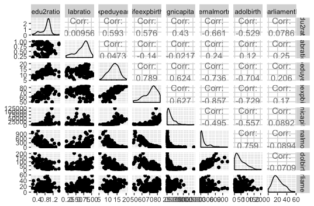
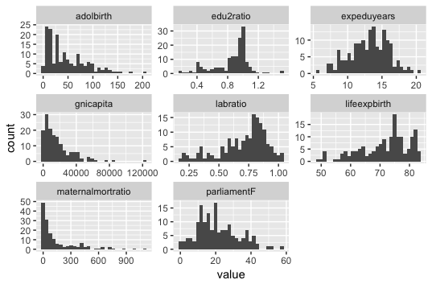
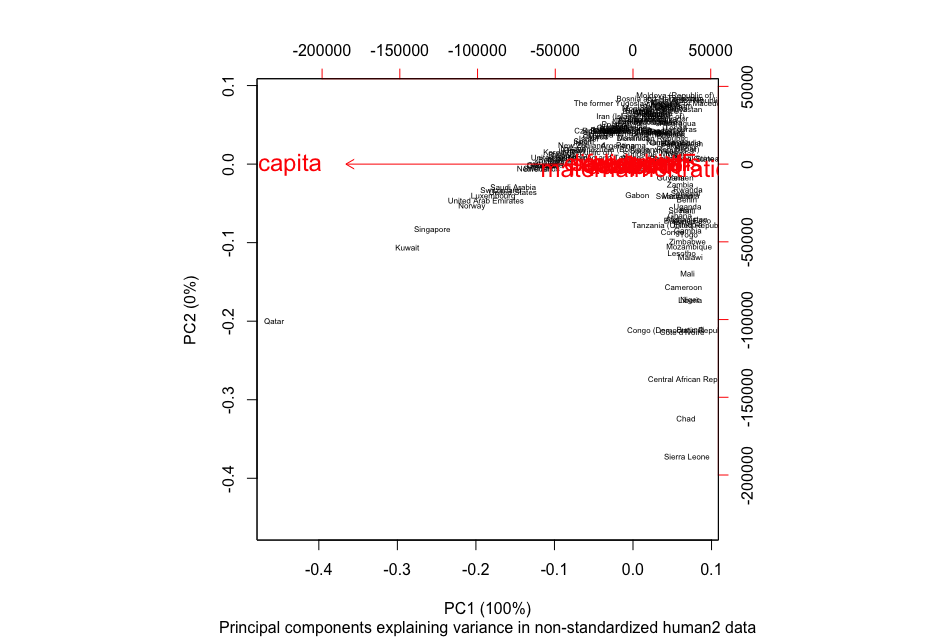
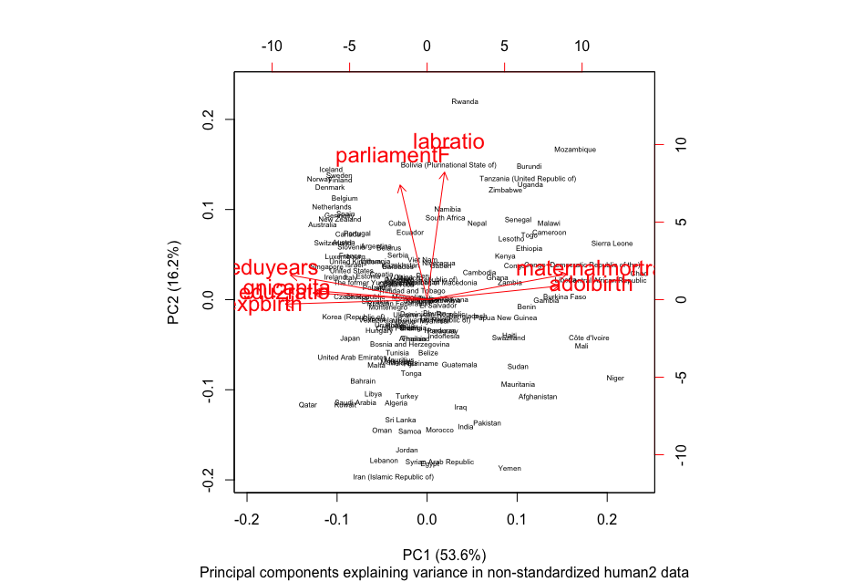
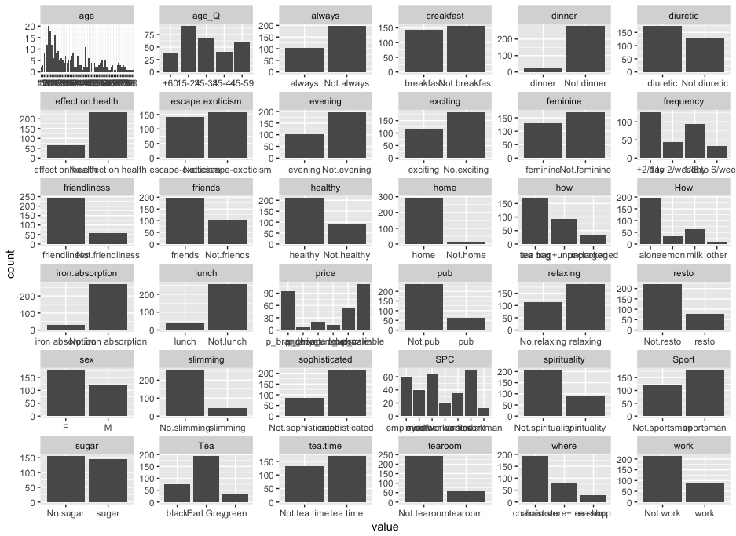
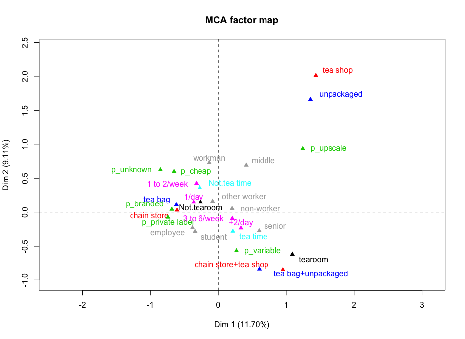

# Exercise 5

#### Part 1 

read data  
human2 <- read.table("human2.csv", sep = ",", header=TRUE)  

str(human2)  
dim(human2)

The data it is a combination of two datasets and it concerns human development and gender inequality. The data has 9 variables and 155 observations. There are 155 countries. The variables are the ratio of female and male populations with secondary education, the ratio of labor force participation of females and males, expected years of schooling, life expectancy at birth, gross national income per capita, maternal mortality ratio, adolescent birth rate and share of females in parliament.

#### Part 2

library(MASS); library(tidyr); library(dplyr); library(ggplot2); library(GGally)  
  
ggpairs  
p <- ggpairs(human2, mapping = aes(), lower = list(combo = wrap("facethist", bins = 20)))  
p

draw a histogram of each variable  
gather(human2) %>% ggplot(aes(value)) + geom_histogram() + facet_wrap("key", scales = "free")  

 

 

summary(human2)

  edu2ratio         labratio       expeduyears     lifeexpbirth  
 Min.   :0.1717   Min.   :0.1857   Min.   : 5.40   Min.   :49.00  
 1st Qu.:0.7264   1st Qu.:0.5984   1st Qu.:11.25   1st Qu.:66.30  
 Median :0.9375   Median :0.7535   Median :13.50   Median :74.20  
 Mean   :0.8529   Mean   :0.7074   Mean   :13.18   Mean   :71.65  
 3rd Qu.:0.9968   3rd Qu.:0.8535   3rd Qu.:15.20   3rd Qu.:77.25  
 Max.   :1.4967   Max.   :1.0380   Max.   :20.20   Max.   :83.50  
 
 gnicapita      maternalmortratio   adolbirth       parliamentF   
 Min.   :   581   Min.   :   1.0    Min.   :  0.60   Min.   : 0.00  
 1st Qu.:  4198   1st Qu.:  11.5    1st Qu.: 12.65   1st Qu.:12.40  
 Median : 12040   Median :  49.0    Median : 33.60   Median :19.30  
 Mean   : 17628   Mean   : 149.1    Mean   : 47.16   Mean   :20.91  
 3rd Qu.: 24512   3rd Qu.: 190.0    3rd Qu.: 71.95   3rd Qu.:27.95  
 Max.   :123124   Max.   :1100.0    Max.   :204.80   Max.   :57.50  

The variables have different scales and are distributed not very evenly. They describe differences between countries and their development. For example there are a few countries that have high maternal mortality ratio, but the variable of adolescent births is a bit more varied as there are quite many countries where women ages 15-19 give birth. It seems to be common that females ratio of labor force participation to males is 0,5-1 that is the number of females working (officially) compared to men is half or more. Share of women in parliament is quite varied, most countries having under half of the seats taken by women.

Strongest correlations can be found in these: When expected education years grow also life expectancy at birth grow. When expected education years grow maternal mortality and adolescent birth rate decrease. There is also strong negative correlation between life expectancy at birth and maternality mort and adolescent birth rate. And positive correlation between maternal mortality and adolescent birth rate. 

There is also correlation between many other variables. These are traditional variables for measuring development. The variables labor ratio and share of women in parliament are not so strongly correlated with other variables.

#### Part 3

principal component analysis 
pca_human2 <- prcomp(human2)  

create and print out a summary of pca_human  
s <- summary(pca_human2)  
s

Importance of components:  
PC1      PC2   PC3   PC4   PC5   PC6    PC7    PC8  
Standard deviation     1.854e+04 185.5219 25.19 11.45 3.766 1.566 0.1912 0.1591  
Proportion of Variance 9.999e-01   0.0001  0.00  0.00 0.000 0.000 0.0000 0.0000  
Cumulative Proportion  9.999e-01   1.0000  1.00  1.00 1.000 1.000 1.0000 1.0000

rounded percentages of variance captured by each PC  
pca_pr <- round(100*s$importance[2,], digits = 1)  

print out the percentages of variance  
pca_pr

PC1 PC2 PC3 PC4 PC5 PC6 PC7 PC8  
100   0   0   0   0   0   0   0 

create object pc_lab to be used as axis labels  
pc_lab <- paste0(names(pca_pr), " (", pca_pr, "%)")

draw a biplot  
biplot(pca_human2, cex = c(0.5, 1.5), xlab = pc_lab[1], ylab = pc_lab[2], sub = "Principal components explaining variance in non-standardized human2 data")

 

#### Parts 4 and 5

standardize the variables  
human2_std <- scale(human2) 

print out summaries of the standardized variables  
summary(human2_std) 

   edu2ratio          labratio        expeduyears       lifeexpbirth    
 Min.   :-2.8189   Min.   :-2.6247   Min.   :-2.7378   Min.   :-2.7188  
 1st Qu.:-0.5233   1st Qu.:-0.5484   1st Qu.:-0.6782   1st Qu.:-0.6425  
 Median : 0.3503   Median : 0.2316   Median : 0.1140   Median : 0.3056  
 Mean   : 0.0000   Mean   : 0.0000   Mean   : 0.0000   Mean   : 0.0000  
 3rd Qu.: 0.5958   3rd Qu.: 0.7350   3rd Qu.: 0.7126   3rd Qu.: 0.6717  
 Max.   : 2.6646   Max.   : 1.6632   Max.   : 2.4730   Max.   : 1.4218  
   
   gnicapita       maternalmortratio   adolbirth        parliamentF     
 Min.   :-0.9193   Min.   :-0.6992   Min.   :-1.1325   Min.   :-1.8203  
 1st Qu.:-0.7243   1st Qu.:-0.6496   1st Qu.:-0.8394   1st Qu.:-0.7409  
 Median :-0.3013   Median :-0.4726   Median :-0.3298   Median :-0.1403  
 Mean   : 0.0000   Mean   : 0.0000   Mean   : 0.0000   Mean   : 0.0000  
 3rd Qu.: 0.3712   3rd Qu.: 0.1932   3rd Qu.: 0.6030   3rd Qu.: 0.6127  
 Max.   : 5.6890   Max.   : 4.4899   Max.   : 3.8344   Max.   : 3.1850 

principal component analysis  
pca_human2_std <- prcomp(human2_std)  

create and print out a summary of pca_human  
s_std <- summary(pca_human2_std)  
s_std

Importance of components:  
PC1    PC2     PC3     PC4     PC5     PC6     PC7  
Standard deviation     2.0708 1.1397 0.87505 0.77886 0.66196 0.53631 0.45900  
Proportion of Variance 0.5361 0.1624 0.09571 0.07583 0.05477 0.03595 0.02634  
Cumulative Proportion  0.5361 0.6984 0.79413 0.86996 0.92473 0.96069 0.98702  
PC8  
Standard deviation     0.32224  
Proportion of Variance 0.01298  
Cumulative Proportion  1.00000

rounded percentages of variance captured by each PC  
pca_pr_std <- round(100*s_std$importance[2,], digits = 1)  

print out the percentages of variance  
pca_pr_std  

PC1  PC2  PC3  PC4  PC5  PC6  PC7  PC8  
53.6 16.2  9.6  7.6  5.5  3.6  2.6  1.3  

create object pc_lab to be used as axis labels  
pc_lab_std <- paste0(names(pca_pr_std), " (", pca_pr_std, "%)")  

draw a biplot  
biplot(pca_human2_std, cex = c(0.5, 1.5), xlab = pc_lab_std[1], ylab = pc_lab_std[2], sub = "Principal components explaining variance in non-standardized human2 data")

  

  
  In the first plot it seems that the GNI per capita would explain most of the variance. That is because the scales of the variables differ a lot and GNI per capita has greatest values and variation of all the variables so it gets disproportionate impact. It is hard to separate other variables from each other (at least in my picture). They seem to be on the same line and correlated. 

In the second plot where the variables are standardized to same scale it seems that there are many relatively strong components explaining variance. In the standarized plot the first principal component PC1 captures the maximum amount of variance from the features in the original data that is 53,6 %. This combination of variables capture most essential dimensions of the data. Maternal mortality, adolescent birth, life expectancy at birth, expected education years, education ratio and GNI per capita contribute to PC1. Maternity, life expectancy, education and GNI related variables explain most of the variance from the features in the human development data that is human development measured with these terms.

The second principal component PC2 captures maximum amount of variability left. Labor ratio and share of women in parliament contribute to PC2. They had only small correlation with other features in previous part of the exercise. Here 
they explain 16,2 % of the variance. 

It might be that for example education is more directly influencing gender equality issues than share of women in parliament which is perhaps higher in more developed states. The ratio of labor force participation of females and males could be not explaining the variance so much, because labor force participation of women in developing countries could be low or high depending on other factors like culture and sectors of economy. This is just guessing.

The variables on the x-axis, PC1, have quite small angle between them so they are highly correlated with each other. The variables on the y-axis, PC2, have a bit greater angle between them so they are correlated with each other but a bit less. The correlation between the features and pc axis is quite strong with all the features I think. Lengths of the arrows tell about the standard deviations of the features. For example the labor ratio has greater deviation than share of women in parliament.  

#### Part 6

install.packages("FactoMineR")  
library(FactoMineR)  
data("tea")  

str(tea)  
dim(tea)

The tea dataset concerns different ways of drinking tea. There are 36 variables and 300 observations in the tea dataset. The variables include for example where and when one drinks tea, how (e.g. with sugar) and how much, reasons for drinking and undertanding of what it is like. There are also some socio-economic variables included.

bar plot  
gather(tea) %>% ggplot(aes(value)) + geom_bar() + facet_wrap("key", scales = "free")  

  
  
  Different variables have different scales. Many of the variables are binary and all are categorical except for age.

column to keep in the dataset  
keep_columns <- c("tearoom", "where", "price", "how", "tea.time", "frequency", "SPC")

select the 'keep_columns' to create a new dataset  
tea_use <- select(tea, one_of(keep_columns))

multiple correspondence analysis  
mca <- MCA(tea_use, graph = FALSE) 

summary of the model  
summary(mca)

visualize MCA  
plot(mca, invisible=c("ind"), habillage = "quali") 

Call:  
MCA(X = tea_use, graph = FALSE) 

Eigenvalues  
Dim.1   Dim.2   Dim.3   Dim.4   Dim.5   Dim.6   Dim.7  
Variance               0.334   0.260   0.187   0.180   0.167   0.163   0.155  
% of var.             11.703   9.109   6.530   6.309   5.862   5.695   5.431  
Cumulative % of var.  11.703  20.812  27.342  33.651  39.513  45.209  50.639  
  
  Dim.8   Dim.9  Dim.10  Dim.11  Dim.12  Dim.13  Dim.14  
Variance               0.148   0.145   0.139   0.129   0.125   0.120   0.115  
% of var.              5.165   5.069   4.881   4.519   4.382   4.210   4.039  
Cumulative % of var.  55.805  60.873  65.755  70.274  74.656  78.866  82.905  
  
  Dim.15  Dim.16  Dim.17  Dim.18  Dim.19  Dim.20  
Variance               0.110   0.097   0.090   0.075   0.068   0.048  
% of var.              3.858   3.401   3.155   2.624   2.371   1.685  
Cumulative % of var.  86.763  90.165  93.320  95.944  98.315 100.000

Individuals (the 10 first)  
Dim.1    ctr   cos2    Dim.2    ctr   cos2    Dim.3    ctr  
1                    | -0.637  0.404  0.080 |  0.592  0.448  0.069 |  0.150  0.040  
2                    | -0.360  0.129  0.069 |  0.258  0.085  0.035 | -0.175  0.055  
3                    | -0.189  0.036  0.013 | -0.177  0.040  0.011 |  0.588  0.618  
4                    | -0.547  0.298  0.210 | -0.015  0.000  0.000 |  0.119  0.025  
5                    | -0.384  0.147  0.103 | -0.107  0.015  0.008 | -0.266  0.127  
6                    | -0.796  0.632  0.205 |  0.123  0.019  0.005 |  0.516  0.475  
7                    | -0.052  0.003  0.001 | -0.260  0.086  0.024 |  0.155  0.043  
8                    | -0.230  0.053  0.023 |  0.156  0.031  0.010 |  0.508  0.460  
9                    |  0.909  0.824  0.294 | -0.388  0.193  0.054 | -0.016  0.000  
10                   |  1.122  1.255  0.366 | -0.423  0.229  0.052 |  0.066  0.008  

cos2  
1                     0.004 |
2                     0.016 |
3                     0.125 |
4                     0.010 |
5                     0.050 |
6                     0.086 |
7                     0.009 |
8                     0.110 |
9                     0.000 |
10                    0.001 |

Categories (the 10 first)  
Dim.1     ctr    cos2  v.test     Dim.2     ctr    cos2  
Not.tearoom          |  -0.261   2.351   0.285  -9.225 |   0.148   0.973   0.092  
tearoom              |   1.090   9.808   0.285   9.225 |  -0.618   4.058   0.092  
chain store          |  -0.611  10.195   0.663 -14.078 |   0.029   0.030   0.002  
chain store+tea shop |   0.952  10.060   0.318   9.754 |  -0.845  10.192   0.251  
tea shop             |   1.434   8.781   0.228   8.263 |   2.011  22.193   0.449  
p_branded            |  -0.686   6.370   0.218  -8.077 |   0.041   0.030   0.001  
p_cheap              |  -0.654   0.426   0.010  -1.748 |   0.600   0.461   0.009  
p_private label      |  -0.743   1.652   0.042  -3.526 |  -0.075   0.022   0.000  
p_unknown            |  -0.854   1.246   0.030  -3.014 |   0.624   0.856   0.016  
p_upscale            |   1.243  11.654   0.331   9.953 |   0.934   8.455   0.187  
  
  v.test     Dim.3     ctr    cos2  v.test  
Not.tearoom            5.235 |  -0.129   1.023   0.069  -4.544 |  
tearoom               -5.235 |   0.537   4.266   0.069   4.544 |  
chain store            0.672 |   0.125   0.769   0.028   2.887 |  
chain store+tea shop  -8.662 |  -0.334   2.225   0.039  -3.427 |  
tea shop              11.590 |   0.068   0.035   0.001   0.390 |  
p_branded              0.485 |  -0.626   9.510   0.182  -7.372 |  
p_cheap                1.604 |  -0.700   0.875   0.012  -1.870 |  
p_private label       -0.356 |   1.371  10.071   0.141   6.503 |  
p_unknown              2.203 |   1.155   4.088   0.056   4.078 |  
p_upscale              7.479 |   0.046   0.028   0.000   0.365 |

Categorical variables (eta2)  
Dim.1 Dim.2 Dim.3  
tearoom              | 0.285 0.092 0.069 |  
where                | 0.680 0.591 0.040 |  
price                | 0.526 0.299 0.332 |  
how                  | 0.552 0.556 0.009 |  
tea.time             | 0.059 0.102 0.043 |  
frequency            | 0.109 0.057 0.366 |  
SPC                  | 0.131 0.125 0.447 |

 

It seems that dimension 1 explains 11,7 % of the variance and dimension 2 9,11 % of the variance. I chose variables describing how much tea use is specialised e.g. whether one goes to special tea shop instead of chain store that I thought might be slightly similar with each other. Therefore it is understandable that these variables do not catch much of the variance. 

Tea shop and unpackaged tea are not close to other categories, so there is not so strong link between them. Also tearoom, going to chain stores and tea shops and using tea bags and unpackaged tea have a slightly greater distance from other categories. It seems that there is a number of users that differentiate from the mass. 

The variable where has strongest squared correlation between variables and dimensions. In the variables the strongest categories are for dimension 1 chain store and dimension 2 tea shop. Does it mean that they are explain the variance a bit more than other variables?

Also p_upscale, chain store+tea shop, tearoom and tea shop contribute a lot to dimension 1 and chain store+tea shop and p_upscale contribute a lot to dimension 2. So they also explain the variance more than other categories?

